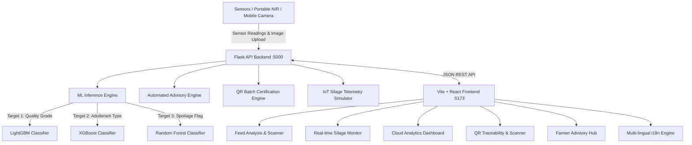

# 🌾 KisanDoodh FeedQuality AI — Smart Feed & Silage Testing System

> **Smart India Hackathon (SIH 2024)**  
> **Problem Statement ID:** 26111  
> **Problem Statement Title:** Smart AI-Enabled Rapid Feed and Silage Quality Testing System for Dairy Farmers  
> **Ministry / Department:** Ministry of Fisheries, Animal Husbandry and Dairying

---

## 📌 Executive Summary

Animal nutrition directly determines milk production, animal health, reproductive longevity, and dairy farm profitability. Substandard feed and spoiled silage cause a **25%–40% loss in daily milk yield**, elevated incidence of mastitis, reproductive failure, and toxic aflatoxins in consumer milk.

Conventional feed testing laboratories take **5–10 days** and cost over **₹2,000 per test**, making routine quality assessment inaccessible for rural dairy farmers.

**KisanDoodh FeedQuality AI** provides a rapid, portable, and digitally enabled feed quality assessment platform combining:
- **Multi-Target Machine Learning (LightGBM, Random Forest, XGBoost)** predicting Quality Grade, Adulterant Type, and Spoilage Risk in under 10 seconds.
- **Computer Vision & NIR Spectroscopy Simulation** for camera-based mobile feed screening.
- **IoT Silage Bunker Telemetry** with real-time tracking of fermentation pH, internal temperature, moisture, and CO₂ gas accumulation.
- **Cryptographic QR Code Traceability** with SHA-256 HMAC digital signatures for tamper-proof batch verification.
- **Multilingual Farmer Advisory Hub & Ration Calculator** supporting **5 regional languages** (English, Hindi, Marathi, Tamil, Telugu).
- **Rural Field-Ready & Offline PWA Architecture** designed for cowshed operations with low or intermittent connectivity.

---

## 🚀 Key Modules & Capabilities

### 1. Rapid Multi-Target Feed Analysis (`/analyze`)
- **Quick Test Presets:** Clean Cattle Pellet, Quality Maize Silage, Mould-Contaminated Feed Mash, and Urea-Adulterated Mineral Mixture.
- **Comprehensive Sensor Profiles:** Crude Protein %, Moisture %, Crude Fiber %, Metabolizable Energy (Mcal/kg), Mineral Deficiency Index, Urea %, Sand/Silica %, Aflatoxin B1 (ppb), Fungal Load Index, Storage Temperature, and Silage pH.
- **Multi-Target Prediction Engine:**
  - **Quality Status:** Good / Moderate / Poor / Unsafe
  - **Adulteration Detection:** Urea Adulteration, Sand/Silica Contamination, Mould/Fungal Growth, or None (Clean)
  - **Spoilage Risk Flag:** Fresh & Safe vs. Spoiled & Toxic
- **Visual Nutritional Balance Meters:** Instant benchmarking against Bureau of Indian Standards (BIS) dairy guidelines.
- **Certified QR Batch Generator:** Instant creation of verifiable digital batch certificates.

### 2. Real-Time IoT Silage Fermentation Monitor (`/silage`)
- **Live Telemetry Gauges:** Continuous monitoring of pH (optimal 3.8–4.5), internal temperature (<28°C), moisture (60–68%), and CO₂ build-up.
- **Multi-Bunker Management:** Multi-pit selector with sealing duration, location tracking, and spoilage risk categorization.
- **24-Hour Fermentation History:** Interactive Chart.js timeline tracking anaerobic fermentation trends and temperature stability.
- **Farmer Education:** Real-time actionable guidance on lactic acid fermentation and aerobic spoilage prevention.

### 3. Supply Chain QR Traceability (`/qr`)
- **Tamper-Evident Batch Certificate:** Format `FQ-YYYYMMDD-XXXXXXXX` signed cryptographically.
- **Batch Verification Portal:** Farmers and inspectors can verify feed bag certificates before purchase to prevent counterfeit feed fraud.
- **Verification Audit Log:** Track inspection frequency and certified batch parameters.

### 4. Dairy Advisory Hub & Feeding Calculator (`/advisory`)
- **Scientific Ration Calculator:** Balanced daily concentrate, roughage, and mineral guidelines by cattle category:
  - Lactating Cow (15L/day), Lactating Cow (10L/day), Dry Cow, Growing Heifer, Young Calf, and Breeding Bull.
- **Nutritional Reference Standards:** Guidelines for Protein, Energy, Fiber, Minerals, and Aflatoxins.
- **On-Farm Contamination Detection:** Physical field tests and symptom checks for urea poisoning, sand contamination, and fungal mould.
- **Silage Best Practices:** Packing, sealing, and FIFO stock rotation rules.

### 5. Surveillance Analytics Dashboard (`/dashboard`)
- **Aggregated Herd Metrics:** Total tests conducted, safe quality ratio, active silage pits, and adulterations flagged.
- **Interactive Visualizations:**
  - Doughnut chart: Quality Grade Distribution
  - Bar chart: Feed Types Analyzed
  - Line chart: Monthly Testing Volume Trends
- **Contaminant Outbreak Cards:** Frequency counts for Urea, Sand, and Mould incidents.
- **Audit Table:** Filterable history of recent feed analyses.

### 6. Full Multilingual Localization
Supports 5 Indian languages with zero hardcoded text:
- **English** (`en`)
- **हिन्दी (Hindi)** (`hi`)
- **मराठी (Marathi)** (`mr`)
- **தமிழ் (Tamil)** (`ta`)
- **తెలుగు (Telugu)** (`te`)

---

## 🛠️ Architecture & Tech Stack



### Backend
- **Python 3.14** / **Flask** / **Flask-CORS**
- **Scikit-Learn**, **LightGBM**, **XGBoost**, **Joblib**
- **OpenCV (Headless)** & **Pillow** (Computer vision feature extraction)
- **PyQRCode** (Cryptographic QR batch generation)
- **Pandas** & **NumPy**

### Frontend
- **React 19** with **Vite**
- **React-Router-DOM**
- **i18next** & **react-i18next** (Multilingual framework)
- **Chart.js** & **react-chartjs-2** (Data visualization)
- **Lucide React** (Agrarian icons)
- **Custom Agrarian Design System** (Vanilla CSS with warm buttermilk cream, pasture emerald, and harvest wheat tokens)

---

## ⚡ Quick Start & Local Setup

### Prerequisites
- Python 3.10+ (tested on Python 3.14)
- Node.js 18+ and npm

### 1. Clone Repository
```bash
git clone https://github.com/balamarish2000-cmd/SIH-26111-FeedQuality-AI.git
cd SIH-26111-FeedQuality-AI
```

### 2. Backend Setup
```bash
cd backend
pip install -r requirements.txt
python app.py
```
*Backend runs on `http://localhost:5000` (Health check: `/api/health`)*

### 3. Frontend Setup
```bash
cd frontend
npm install
npm run dev
```
*Frontend runs on `http://localhost:5173`*

---

## 📜 API Documentation

| Method | Endpoint | Description |
| :--- | :--- | :--- |
| `GET` | `/api/health` | Health check & model status |
| `POST` | `/api/predict` | Predict feed quality, adulteration & spoilage from sensor inputs |
| `POST` | `/api/predict/image` | Computer vision feed image feature extraction & prediction |
| `GET` | `/api/silage/monitor` | Simulated real-time IoT silage telemetry & bunker alerts |
| `POST` | `/api/qr/generate` | Generate cryptographically signed QR certificate |
| `GET` | `/api/qr/verify/<id>` | Verify batch certificate authenticity |
| `GET` | `/api/qr/batches` | List all certified feed batches |
| `GET` | `/api/dashboard/stats` | Aggregated analytics & recent testing history |

---

## 👥 Contributors & Acknowledgements

Developed for **Smart India Hackathon 2024**  
**Team Leader & Developer:** Balamarish ([@balamarish2000-cmd](https://github.com/balamarish2000-cmd))  
**Problem Statement:** 26111 — *Smart AI-Enabled Rapid Feed and Silage Quality Testing System for Dairy Farmers*
